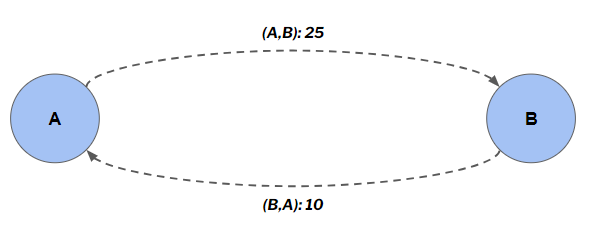

# Diagnosis Code Embeddings using Graph Neural Networks
**Diagnosis code embeddings** are disease representations (or disease vectors) where similar diseases have similar representations. They are quite similar to word embeddings used in NLP tasks. Word embeddings (or word representations) learning has been one of the key breakthroughs for impressive performance of deep-learning models in NLP tasks.

Here, we explore the possibility of learning ICD-10 disease embeddings for healthcare related tasks. 

Our expectations are as follows -
1. The representations should capture the latent relationships (correlations) between different ICD-10 diagnosis codes
2. These representations, if used in downstream applications (ML models), should considerably improve the model performance

Representation learning tasks typically involve the use of Neural Networks in some form or the other to learn d-dimensional representations. In our case, we shall be using **Graph Neural Networks (GNNs)** for disease representation learning.

**Why GNNs?** Graphs are an excellent alternative to relational databases for representing highly connected data (like patient records). GNNs are used for node and edge level prediction tasks, and use graph based data which contain information encoded in nodes and edges (instead of rows and columns). GNNs are able to extract relationships between nodes (say, patients, diseases, medications, etc.) that classical ML models based on relational databases simply cannot.

**Data**
- Claims data for 10,000+ Patient IDs having 20,000+ IP visits and 370,000+ OP visits made over 2 consecutive years

**Problem Statement** - Create Disease Embeddings for ICD-10 codes using historic IP and OP claims data

**Methodology** - Apply a GNN based ML model to learn the node embeddings of a directed homogenous graph using supervised learning

***How do we define the directed homogenous graph?***

Our aim is to learn node embeddings, since the ICD-10 disease codes shall represent individual nodes. In any GNN based model, the node embeddings learnt will depend on -

1. The kind of task being performed,
2. How the node features and edge features are defined, and 
3. How the target variable is defined.

**Node Definition** - A single node denotes a single ICD-10 diagnosis code

**Edge Definition** - A single directed edge between 2 nodes going from, say node A to node B, denotes the total number of instances from our entire superset of visits/encounters data, where the encounter in which disease A was diagnosed was followed by another encounter in which disease B was diagnosed.

For instance, 25 instances of encounter A followed by encounter B were observed, and 10 instances of encounter B followed by encounter A were observed -

  

Defining Edge Weights

Since *message passing* between nodes in GNN based architectures works best when these edge weights are in the [0,1] range, we further normalise these edge weights by dividing all the out-edges of a node with the max of all the out-edges of that node. *For instance* -

  

Edge Weight Normalisation

**Node Features** - All the nodes shall be one-hot encoded to create N dimensional vectors (where N is the number of nodes as well). These N-dimensional vectors shall be our input node features. *For instance* -

  

Node Features Created using OHE

**Edge Features** - None

**Training Data** - Following are the specifications of disease graph to be used for representation learning -
- 3,400+ ICD-10 disease nodes
- 22,000+ edges,
- 3400+ node features
- 1 edge feature (weighted edges with weights ranging from 0 to 1)
- Homogenous Directed Graph

***Target Variable*** - The target variable shall be the HCC category a node belongs to. In that sense, this shall be a supervised task of a multi-class classification type.

***GNN specifications*** - We shall be using the GAT (Graph ATtention network) algorithm from the Stellargraph python library.

- 2 layered GNN of size 32 and 16 units respectively
- Loss - Categorical Crossentropy
- Optimiser - Adam
- Train:Test :: 90:10
- Dropout = 50%
- Early Stopping (patience = 50 epochs)

***Intuition*** -
- For an edge connecting node A to node B, a high edge weight close to 1 indicates high tendency of disease progression on aggregate from diagnosis code A to diagnosis code B
- For an edge connecting node A to node B, a low edge weight close to 0 indicates low tendency of disease progression on aggregate from diagnosis code A to diagnosis code B
- A pair of nodes that are directly connected and also have a high edge weight will tend to be similar
- Nodes having same/similar neighbour node sets will tend to be similar
- 2 disease nodes having a high shortest path length will tend to be more dissimilar than a pair of nodes with a low shortest path length

***Training*** -

The model seems to overfit since we are training a neural network on a relatively low-volume data.

  

Training and Validation accuracy (above) and loss (below)

***Node Embeddings*** - 

16-dimensional node embeddings are created for the 3400+ ICD codes present in our training data. Dimensionality reduction using TSNE is performed to reduce the number of dimensions to 2, just for the purpose of visualisation. Using visualisation, we are able to get a feel of whether the ICD-codes associated with a disease group are indeed located closer to each other -

  

Cancer Cluster (left), Diabetes Cluster (right)

  

Ulceration Cluster (left), Transplants, Amputations, Grapfts Cluster (right)

  

Mental Diseases Cluster (left), Heart Diseases Cluster (right)

***Inference and Intuition*** -
- Clusters like Cancer are well segregated and the ICD-nodes for this group rarely see an overlap with a non-cancer cluster
- ICD-nodes for the Ulceration cluster are also well-clustered. However, this cluster overlaps with other non-ulcer clusters as well, which might indicate correlation or causation of the ulcer-diseases with certain diseases of other categories
- ICD-nodes for the Mental Diseases Cluster share heavy overlap with other disease clusters like Heart Cluster and Diabetes Cluster. This indicates that Mental diseases are a part of disease progression into/from these clusters

### Possible Use Case - Suspect Codes
Clinical suspecting is usually done using medication, vitals and other sources of data to reduce coding gaps by identifying HCC codes which may have inadvertently left out by a physician’s coders during coding. 

We can implement a ICD-HCC similarity based suspect algorithm which in the case of a homogenous disease network will be patient-agnostic. The suspect codes predicted using this algorithm may predict certain HCC codes that are similar to a given set of ICD-10 diagnosis observed in a patient. 

***How does the Patient Agnostic Suspect Model work*** -
- Identify the K-nearest neighbours to the reference ICD-node, and map their HCC codes
- Compute the statistical mode out of those K-HCC codes, and exclude any disease nodes that have the same HCC mapped to them as the reference ICD node. 
- For instance, let’s assume K=5, and say, the reference node belongs to HCC-2. We exclude any neighbouring disease nodes belonging to HCC-2 group from our calculations. Next, we identify the top 5 “nearest“ disease nodes to the reference nodes using Pearson’s correlation coefficient as the similarity metric between 2 nodes -

  

Identifying the top 5 nearest neighbours to the reference disease node (in yellow)

- Out of these 5 most similar disease nodes, 3 belong to HCC-6 and 2 belong to HCC-22. The statistical mode, therefore, is HCC-6, since it occurs the most number of times
- We call HCC-6 as the modal HCC of our reference disease node (in yellow colour above)
- Now, for a modal HCC to be a suspect HCC, following 3 conditions must be satisfied
    - It must not have already been recorded as an existing HCC condition in the patient
    - It must not have a more severe HCC condition from the same family of HCCs already recorded in the patient. For instance, if the HCC-19 is observed as a modal HCC and HCC-17 has already been coded as an existing HCC condition for the patient, then HCC-19 will not be recorded as a suspect condition (note that HCC-17, 18 and 19 belong to the Diabetes family, with HCC-17 being more severe than HCC-18 and HCC-19)
    - The similarity score of the reference disease node with the modal HCC should be more than a threshold (say, 80%)

Let’s now see the patient-agnostic suspect model in action.

**Example 1:**

- Patient ID = M0077563063 
    - Modal HCC for I25119 (HCC-88)= 85 [Similarity (corr): 0.927] 
    - Modal HCC for I208 (HCC-88)= 189 [Similarity (corr): 0.528]
    - Existing HCCs = [88]
    - Suspect HCCs = [85]

  

**Observations** -

- It can be seen that I25119 although belonging to HCC-88, is actually more similar to HCC-85 as it is situated dead in the centre of the HCC-85 cluster
- The mode of top-K (here K=10) neighbours = HCC-85 
- Therefore, HCC-85 is the suspect code for I25119
- Theoretically it can be said that there is disease progression happening to and from I25119 to the nodes of HCC-85 cluster more than the HCC-88 cluster, to which it belongs. Hence the node embeddings (or disease representation) for I25119 has more similarities to the HCC-85 cluster. 
- Therefore it can be reasoned that, at a population or aggregate level, patients diagnosed with I25119 may have an uncoded or yet unidentified disease from the HCC-85 category. Hence, the HCC-85 category is “suspect“
- Note that HCC-189, which is a modal HCC for I208 disease node, is not a suspect code, since it violates the (c.) criteria above (similarity of HCC-189 with I208 falls below threshold of 80%)

**Example 2:**

- Patient ID = M0146764340
    - Modal HCC for A419 (HCC-2)= 84 [Similarity (corr): 0.898] 
    - Modal HCC for C3491 (HCC-9)= 8 [Similarity (corr): 0.91]
    - Modal HCC for C3411 (HCC-9)= 8 [Similarity (corr): 0.893]
    - Modal HCC for C3490 (HCC-9)= 11 [Similarity (corr): 0.709]
    - Modal HCC for E1165 (HCC-18)= 161 [Similarity (corr): 0.473]
    - Modal HCC for I130 (HCC-85)= 112 [Similarity (corr): 0.771]
    - Existing HCCs = [2, 9, 18, 85]
    - Suspect HCCs = [8, 84, 112]

  

### Future Work -

- Evaluate the results of the graph-based suspect model with that of the current clinical suspecting model used at Innovaccer and compare the results
- Explore heterogenous GNN by combining disease graph with patient graph, medication graph etc.
- Increase the volume of training data for GNN
